# System Design Fundamentals - Complete Guide

A comprehensive guide to understanding core system design concepts for building scalable, reliable, and high-performance distributed systems.

---

## Table of Contents

- [What is System Design?](#what-is-system-design)
- [DNS Server](#dns-server)
- [Rate Limiting](#rate-limiting)
- [System Failure](#system-failure)
- [Scaling Strategies](#scaling-strategies)
  - [Vertical Scaling](#vertical-scaling)
  - [Horizontal Scaling](#horizontal-scaling)
- [Load Balancer](#load-balancer)
- [API Gateway](#api-gateway)
- [Batch Processing](#batch-processing)
- [Fanout Architecture](#fanout-architecture)
- [Database Scaling](#database-scaling)
- [Caching with Redis](#caching-with-redis)
- [Content Delivery Network (CDN)](#content-delivery-network-cdn)

---

## What is System Design?

System Design is the process of defining the architecture, components, modules, and data flow of a system to satisfy specific requirements. When building platforms that need to:

- **Perform multiple tasks simultaneously**
- **Serve all users concurrently**
- **Maintain zero downtime**
- **Secure user data**
- **Provide reliable services**

Good system design provides:

- ✅ **Robustness** - System stability under load
- ✅ **Data Security** - Protection of sensitive information
- ✅ **High Availability** - Minimal to zero downtime

---

## DNS Server

**DNS (Domain Name System)** acts like the internet's phone book, translating human-readable domain names into IP addresses.

### How DNS Works

```
User Input: www.example.com
     ↓
DNS Server: Maps domain to IP
     ↓
Returns: 192.168.1.1
```

### DNS Resolution Process

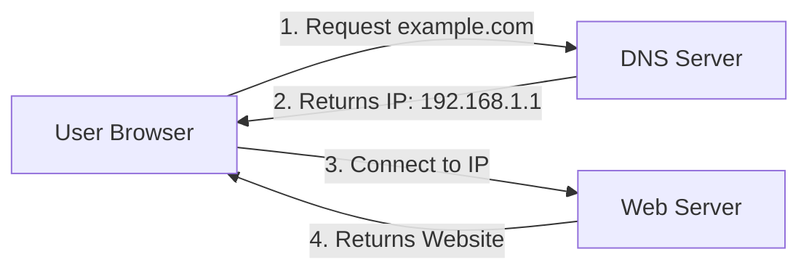

**Key Points:**

- DNS stores data as key-value pairs (domain → IP address)
- DNS resolution is the complete process of converting a domain name to an IP address
- Multiple DNS servers work hierarchically (Root → TLD → Authoritative)

---

## Rate Limiting

Rate Limiting controls how many requests a user or service can make to an API within a specific time window.

### Purpose

- Prevent DDoS (Distributed Denial of Service) attacks
- Protect system resources from overload
- Ensure fair usage among all users
- Prevent abuse and spam

### Common Rate Limit Patterns

```
Per User: 100 requests/minute
Per IP: 1000 requests/hour
Per API Key: 10,000 requests/day
```

**Example:** If a user exceeds 100 requests in one minute, subsequent requests return `429 Too Many Requests` error.

---

## System Failure

System failure occurs when physical resources (CPU, Memory, Disk) are exhausted, leading to:

- System errors
- Service downtime
- Performance degradation
- Data loss risks

**Prevention strategies include proper scaling, monitoring, and resource management.**

---

## Scaling Strategies

### Vertical Scaling

**Vertical Scaling** means increasing the physical resources of a single server (CPU, RAM, Storage).

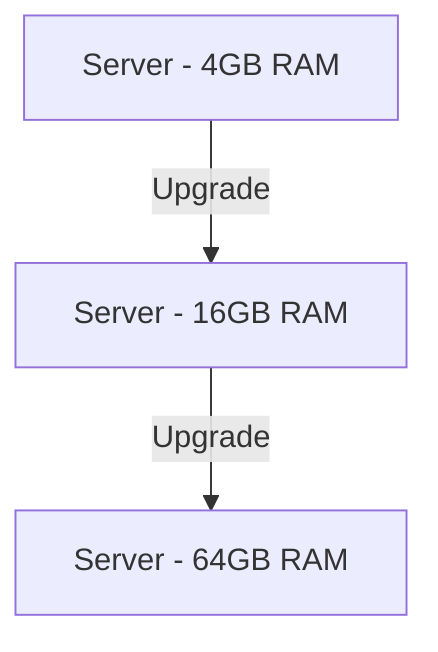

#### Pros

- Simple to implement
- No application code changes needed
- Maintains data consistency

#### Cons

- ❌ **Requires system restart** - Causes downtime
- ❌ **Limited by hardware** - Cannot scale infinitely
- ❌ **Single point of failure**
- ❌ **Resource wastage** - Often over-provisioned for peak loads (using only 30-40% on average)
- ❌ **Expensive** - High-end hardware costs increase exponentially

**Critical Issue:** During sales events or high-traffic periods, you cannot afford downtime to upgrade servers.

---

### Horizontal Scaling

**Horizontal Scaling** means adding more servers (nodes) to distribute the load.

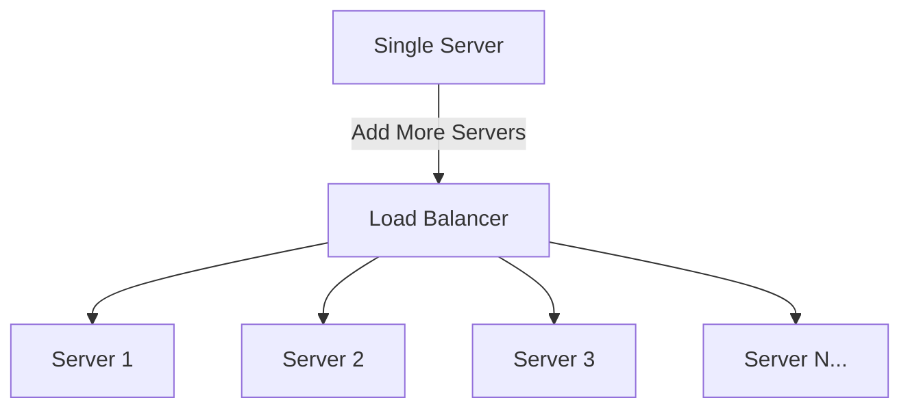

#### Pros

- ✅ **Zero downtime** - Add servers without restarting existing ones
- ✅ **True scalability** - Add servers as needed
- ✅ **Cost-effective** - Use commodity hardware
- ✅ **Fault tolerance** - If one server fails, others continue serving
- ✅ **Elastic scaling** - Auto-scale based on demand

#### How It Works

1. Existing servers handle all requests
2. New server spins up in the background
3. Once ready, new server joins the pool
4. Load balancer distributes traffic to all servers
5. No user impact during the process

---

## Load Balancer

A **Load Balancer** distributes incoming network traffic across multiple servers to ensure optimal resource utilization and prevent overload.

### Architecture Flow

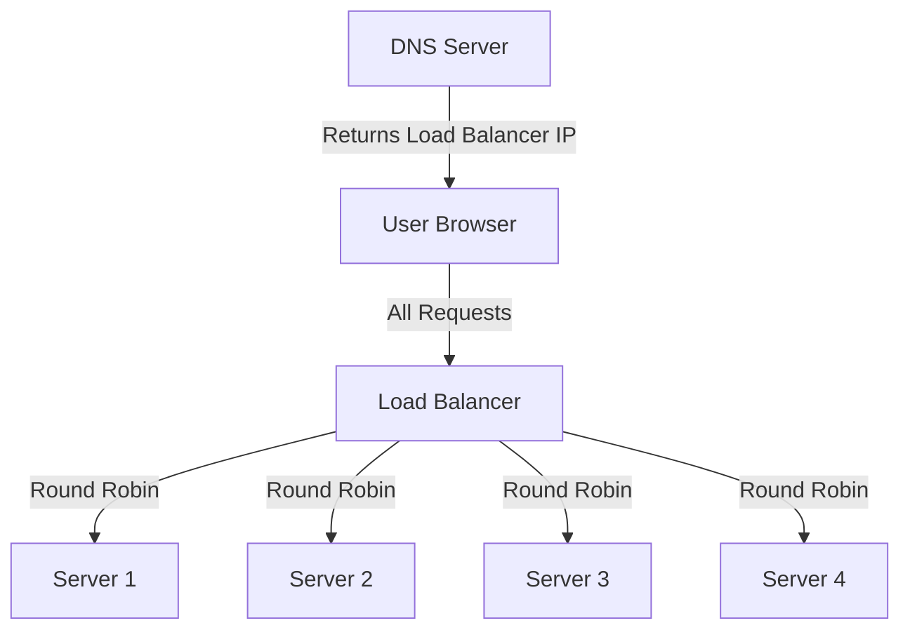

### Load Balancing Algorithms

1. **Round Robin** - Distributes requests sequentially to each server
2. **Least Connections** - Routes to server with fewest active connections
3. **IP Hash** - Routes based on client IP address
4. **Weighted Round Robin** - Distributes based on server capacity

### Configuration

The Load Balancer's IP address is registered in the DNS server, so all user requests first hit the load balancer, which then intelligently distributes them.

---

## API Gateway

An **API Gateway** acts as a single entry point for all client requests and routes them to appropriate microservices.

### Architecture

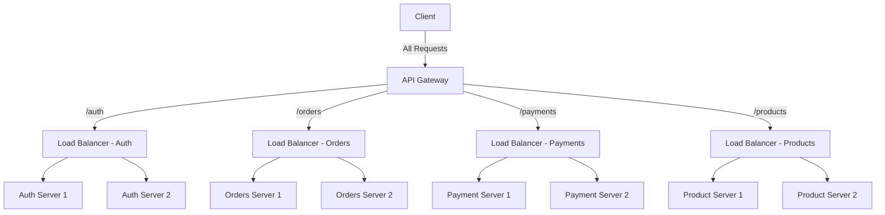

### Responsibilities

- **Request Routing** - Direct requests to correct microservice
- **Authentication & Authorization** - Verify user identity and permissions
- **Rate Limiting** - Enforce API usage limits
- **Request/Response Transformation** - Modify data format if needed
- **Protocol Translation** - Convert between different protocols (HTTP, WebSocket, gRPC)
- **Aggregation** - Combine responses from multiple services

---

## Batch Processing

**Batch Processing** handles tasks asynchronously, typically used when depending on third-party services or handling non-critical operations.

### Use Case: Email Invoice System

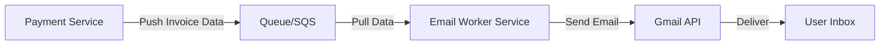

### How It Works

1. User completes payment
2. Payment service pushes invoice details to a **Queue (SQS)**
3. Email worker pulls data from queue
4. Worker sends invoice via Gmail API
5. User receives email

### Benefits

- ✅ **Decoupling** - Payment service doesn't wait for email to be sent
- ✅ **Reliability** - Queue ensures no data loss if worker is temporarily down
- ✅ **Retry Mechanism** - Failed emails can be retried
- ✅ **Acknowledgment** - Confirmation when task completes

### Limitation

**Problem:** Queues follow 1-to-1 communication. If you need to trigger **multiple services** when a payment occurs (email, SMS, analytics, inventory), a queue alone isn't sufficient.

**Solution:** Use **Pub/Sub Architecture**

---

### Pub/Sub Architecture

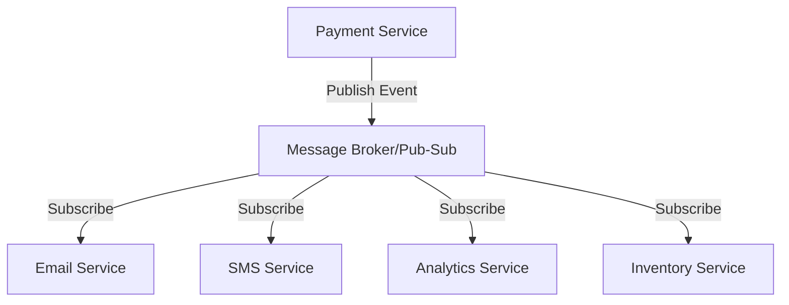

### Key Differences

| Feature        | Queue           | Pub/Sub            |
| -------------- | --------------- | ------------------ |
| Communication  | 1-to-1          | 1-to-Many          |
| Acknowledgment | ✅ Yes          | ❌ No              |
| Use Case       | Task processing | Event broadcasting |

---

## Fanout Architecture

**Fanout Architecture** combines the best of both Pub/Sub and Queue mechanisms.

### Architecture

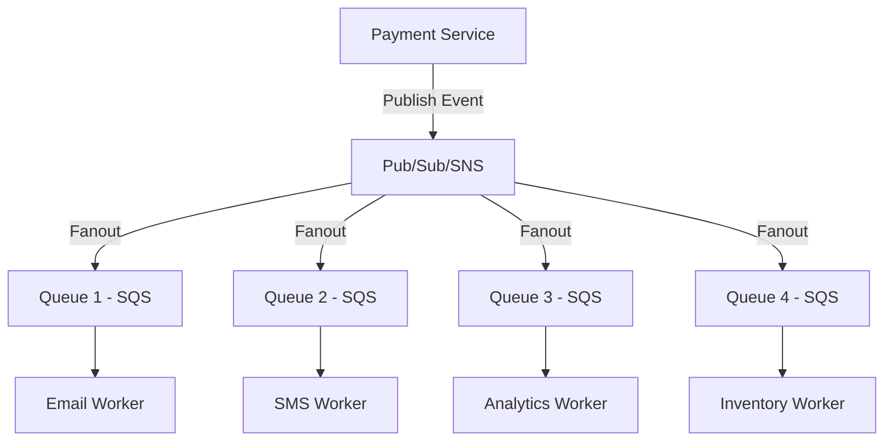

### How It Works

1. **Event Published** - Payment service publishes event to Pub/Sub (SNS)
2. **Fanout** - Pub/Sub broadcasts to all subscribed queues simultaneously
3. **Queue Buffering** - Each service has its own queue (SQS)
4. **Worker Processing** - Workers pull from their respective queues
5. **Acknowledgment** - Each worker confirms completion

### Benefits

- ✅ **Broadcasting** - Multiple services receive events simultaneously
- ✅ **Reliability** - Queue ensures delivery and retry
- ✅ **Acknowledgment** - Confirmation of task completion
- ✅ **Fault Tolerance** - If one worker fails, others continue
- ✅ **Scalability** - Each service can scale independently

**Example Services:** AWS SNS (Pub/Sub) + AWS SQS (Queue)

---

## Database Scaling

As your application grows, database becomes a bottleneck. Here's how to scale it.

### Read Replicas

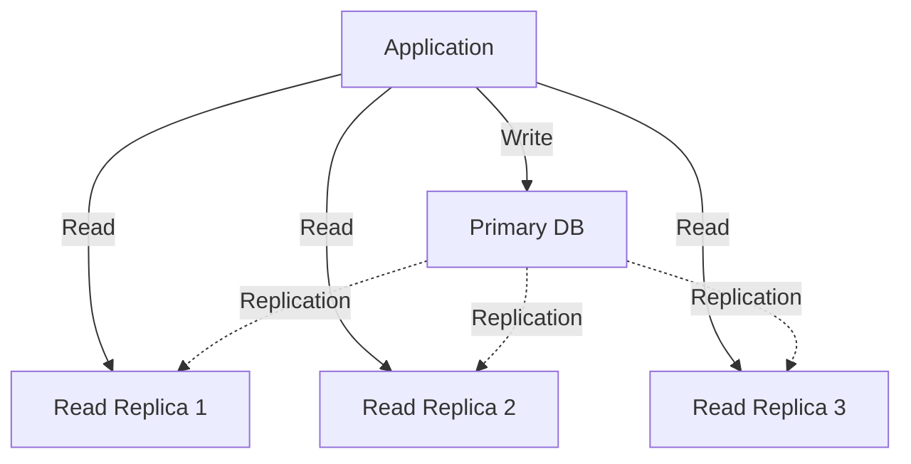

### Strategy

- **Primary Database** - Handles all WRITE operations (INSERT, UPDATE, DELETE)
- **Read Replicas** - Handle all READ operations (SELECT queries)
- **Use Cases for Read Replicas:**
  - Analytics queries
  - Reporting dashboards
  - Search functionality
  - Logs and audits

### Benefits

- ✅ Reduces load on primary database
- ✅ Improves read performance
- ✅ Geographic distribution for lower latency
- ✅ Backup and disaster recovery

### Important Considerations

- Data replication has a slight delay (eventual consistency)
- Read replicas are eventually consistent, not real-time
- Critical reads should still hit the primary database

---

## Caching with Redis

**Caching** stores frequently accessed data in memory for ultra-fast retrieval, reducing database load.

### Cache-Aside Pattern

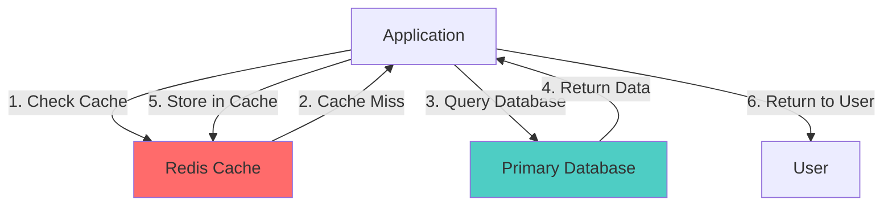

### How It Works

1. **Check Cache First** - Application queries Redis
2. **Cache Hit** - If data exists, return immediately (< 1ms)
3. **Cache Miss** - If not in cache, query the database
4. **Update Cache** - Store result in Redis for future requests
5. **Set Expiration** - Data expires after a certain time (TTL)

### Benefits

- ✅ **Speed** - In-memory access is 100-1000x faster than disk
- ✅ **Reduced DB Load** - 80% of requests served from cache
- ✅ **Cost Savings** - Fewer database resources needed
- ✅ **Scalability** - Handle more users with same DB capacity

### Common Use Cases

- Session storage
- User profiles
- Product catalogs
- API response caching
- Leaderboards and counters

### Cache Invalidation Strategies

- **TTL (Time To Live)** - Data expires after X seconds
- **Write-Through** - Update cache when database changes
- **Cache Invalidation** - Manually delete cache on updates

---

## Content Delivery Network (CDN)

A **CDN** distributes static content across globally distributed edge servers to reduce latency and improve load times.

### How CDN Works

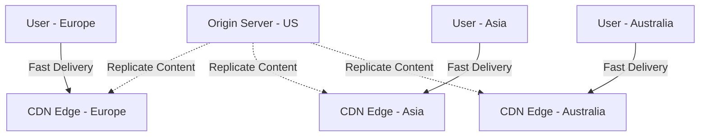

### Architecture

Instead of all users requesting content from a single origin server, CDN deploys edge servers in multiple geographic regions. Users connect to the nearest edge server.

### Benefits

- ✅ **Reduced Latency** - Content served from nearby location
- ✅ **Bandwidth Savings** - Origin server handles fewer requests
- ✅ **DDoS Protection** - Distributed network absorbs attacks
- ✅ **High Availability** - Multiple points of presence
- ✅ **Faster Page Loads** - Better user experience

### What CDN Caches

- Static files (images, CSS, JavaScript)
- Videos and media files
- Downloadable content
- API responses (with proper headers)

### Popular CDN Providers

- **CloudFront** (AWS)
- **Cloudflare**
- **Akamai**
- **Fastly**

---

## Summary

Building scalable systems requires understanding these core concepts:

1. **DNS** - Maps domain names to IP addresses
2. **Rate Limiting** - Protects APIs from abuse
3. **Horizontal Scaling** - Add servers without downtime
4. **Load Balancing** - Distributes traffic efficiently
5. **API Gateway** - Single entry point for microservices
6. **Batch Processing** - Handles async tasks reliably
7. **Fanout Architecture** - Broadcasts events with reliability
8. **Database Scaling** - Read replicas reduce load
9. **Caching** - In-memory storage for speed
10. **CDN** - Global content distribution

---

## Resources for Further Learning

- [System Design Primer GitHub](https://github.com/donnemartin/system-design-primer)
- [AWS Well-Architected Framework](https://aws.amazon.com/architecture/well-architected/)
- [Designing Data-Intensive Applications](https://www.oreilly.com/library/view/designing-data-intensive-applications/9781491903063/)
- [Microservices Patterns](https://microservices.io/patterns/)

---

## License

This document is open-source and free to use for educational purposes.

---

<div align="center">

### Created by **Reeturaj Kumar**

_Building scalable systems, one concept at a time._

[](https://github.com/ReeturajKumar)
[](https://www.linkedin.com/in/reeturaj-kumar-372963238/)

**If this helped you, please ⭐ star this repository!**

</div>
